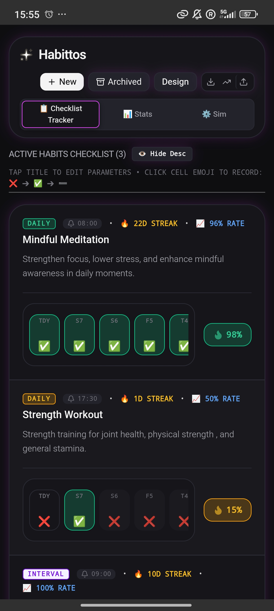
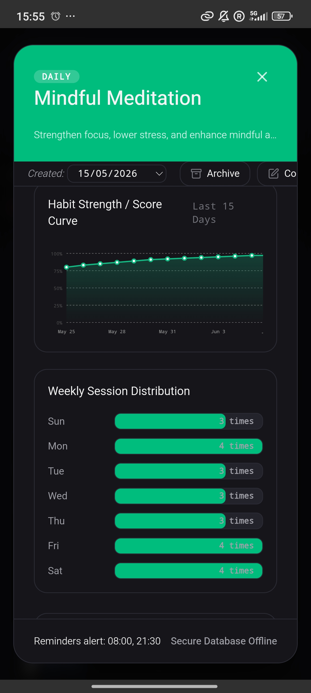

# Habittos

Habittos is an offline-first habit-tracking application designed to help you build, monitor, and sustain daily routines. Featuring a dark, neon-accented user interface, it provides clear progress visualizations, flexible schedule tracking, and actionable habit statistics without relying on cloud-connected databases.

---

## Preview

| Checklist Tracker | Habit Analytics & Details |
| :---: | :---: |
|  |  |

---

## Why Habittos? (Core Features)

Traditional habit trackers rely on rigid, all-or-nothing rules that break your momentum on challenging days. Habittos is designed to mitigate psychological friction and keep you moving forward.

*   **Psychological Friction Mitigation (The Partial Rule)**: Most apps break streaks on busy days, leading to frustration. Habittos introduces a three-tiered scoring system—Complete (`✅`), Partial Buffer (`➖`), and Missed (`❌`). Marking a habit as partial (`➖`) awards 50% credit, keeping your hard-earned streak alive when life gets in the way.
*   **Fully Back-Writable Chronology**: Never lose credit for past work. Modify the original creation date (`createdAt`) of any routine and tap dates directly on your interactive monthly calendar grid to retroactively log, adjust, or backdate entries with absolute freedom.
*   **Modular Visual Density Controls**: Declutter your dashboard instantly. Condense row heights by toggling metadata visibility (`👁️ Hide/Show Desc`) and use the built-in *Aesthetics Controller* to match UI glow modes (Bloom, Subtle, Standard) to your custom habit color themes.
*   **Zero-Cloud Local Vault**: Enjoy total privacy. All routines, logs, and analytics are stored directly in your browser's local cache—no accounts, no trackers, and no internet connection required. Easily back up or restore your data using manual JSON export utilities.

---

## Getting Started in 3 Steps

### 1. Define Your Routine
Tap the **Establish Habit** button to set your rules. Customize your routine name, interval schedules (daily, weekly, or custom days), reminders, and custom color palette.

### 2. Log Honestly
Tap a habit cell on your home dashboard to cycle through states:
`❌ (Missed)` ➔ `✅ (Completed)` ➔ `➖ (Partial/50% Credit)`

### 3. Track & Fine-Tune
Tap any habit title to open the **Deep-Dive View**. Here, you can review 15-day strength curves, view weekly session distributions, or manually adjust past logs on the calendar grid.

---

## Download & Installation

The application is built for mobile efficiency and operates entirely on-device.

*   **Download the APK** and install it directly to your device.

*(Note: This application is Android-only.)**   **Visual Streaks**: Keep track of consecutive successful days with built-in streak counters and visual heat flags.
*   **Detailed Analytics**: 
    *   **Habit Strength & Score Curve**: Track progress patterns over a rolling 15-day window.
    *   **Weekly Session Distribution**: View your historical session density categorized by each day of the week.
*   **Flexible Scheduling**: Configure custom daily routines or specific intervals, with personalized reminder times (e.g., morning and evening alerts).
*   **Secure & Local**: Runs as a secure offline-first application, keeping your personal performance data isolated safely on your device.
*   **Customization**: Built-in styling tools via the `Design` manager to adjust visual components.

---

## How It Works

1.  **Checklist Tracker**: The main panel displays your currently active habits. Tap a habit's title to modify its parameters, or tap the individual day blocks to update your log status.
2.  **Stats**: Access deep metrics for any single habit to evaluate strength curves and weekly distributions.
3.  **Sim (Simulator)**: Use the built-in simulator module to preview or test out habit structures and projection rates over time.
4.  **Import & Export**: Use the download and upload action buttons at the top right to safely back up or restore your local database JSON file.

---

## License

This project is licensed under the [MIT License](LICENSE).
